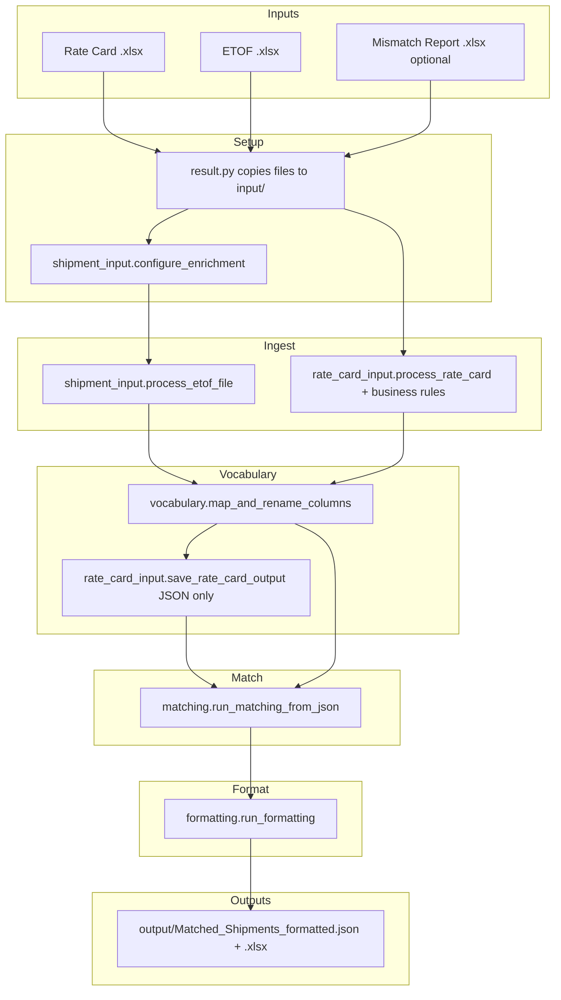

# Apple CANF Customization — Project Overview

**CANF** = **Compare and Find**: match Apple shipment data (ETOF) against a filtered rate card, explain mismatches in human-readable **Discrepancies** (comments), and export formatted Excel/JSON for analysts.

This document describes the repository **end to end**: folder layout, module roles, execution order, inputs/outputs, Apple-specific customizations, and how **comments** are built (matching → formatting).

---

## Table of contents

1. [High-level purpose](#1-high-level-purpose)
2. [Repository layout](#2-repository-layout)
3. [End-to-end process flow](#3-end-to-end-process-flow)
4. [Folder conventions](#4-folder-conventions)
5. [Module reference (by execution order)](#5-module-reference-by-execution-order)
6. [Inputs and outputs](#6-inputs-and-outputs)
7. [Apple / client customizations](#7-apple--client-customizations)
8. [How comments and Discrepancies are built](#8-how-comments-and-discrepancies-are-built)
9. [Matching engine (deep dive)](#9-matching-engine-deep-dive)
10. [Formatting and Excel presentation](#10-formatting-and-excel-presentation)
11. [Auxiliary utilities](#11-auxiliary-utilities)
12. [Running the project](#12-running-the-project)
13. [Dependencies and environment](#13-dependencies-and-environment)
14. [Known variants and maintenance notes](#14-known-variants-and-maintenance-notes)

---

## 1. High-level purpose

| What | Description |
|------|-------------|
| **Business goal** | For each shipment row, find the rate-card **lane(s)** with the fewest differences, list what does not match, and suggest a **Possible Best Match** lane when several lanes tie. |
| **Technical approach** | Excel in → normalized JSON in `partly_df/` → compare each shipment to every (filtered) lane → enrich comments → styled Excel out in `output/`. |
| **Primary UI** | `result.py` — Gradio app **“CANF Analyzer”** that runs the full pipeline after file upload. |
| **Primary data path** | JSON-first: `Matched_Shipments_with.json` is canonical after matching; formatting reads it and writes `Matched_Shipments_formatted.*`. |

---

## 2. Repository layout

```
Apple CANF customization/
├── input/                          # Uploaded / placed source Excel files
├── partly_df/                      # Intermediate JSON, mapping, debug artifacts
├── output/                         # Final deliverables copied for the user
│
├── result.py                       # Gradio orchestrator + Colab path detection
├── shipment_input.py               # ETOF Excel → standardized shipment columns
├── rate_card_input.py              # Rate card Excel → lanes + conditions + BR
├── vocabulary.py                   # Map ETOF columns ↔ rate card columns
├── matching.py                     # Core compare-and-find (use this in production)
├── matching-upd.py                 # Alternate copy (extra accessorial-lane logic; see §14)
├── formatting.py                   # Possible Best Match + comment reformat + Excel style
├── clean_folders.py                # Empty input/, output/, partly_df/ (Colab-safe)
├── upload_to_drive.py              # Optional Google Drive upload helper
│
├── PROJECT_OVERVIEW.md             # This file
└── matching_debug.txt              # Optional debug log (if generated)
```

There is **no** `requirements.txt` in the tree; typical installs: `pandas`, `openpyxl`, `gradio`, `nest_asyncio` (Colab).

---

## 3. End-to-end process flow

### 3.1 Diagram (main pipeline)



### 3.2 Step list (as implemented in `result.py`)

| Step | Module | What happens |
|------|--------|----------------|
| 0 | `result.py` | Resolve project root (`CANF_PROJECT_ROOT`, `__file__`, Colab `/content/CANF_customization`, etc.); create `input/`, `partly_df/`, `output/`. |
| 0b | `result.py` | Copy uploaded files into `input/`. |
| 1 | `shipment_input` | If mismatch report(s) provided: `configure_enrichment()` then `process_etof_file()`. |
| 2 | `rate_card_input` | `process_rate_card()` (used inside vocabulary too). |
| 3 | `vocabulary` | `map_and_rename_columns()` → `partly_df/vocabulary_mapping.json`. |
| 3b | `rate_card_input` | `save_rate_card_output(..., save_excel=False, save_json=True)` → `Filtered_Rate_Card_with_Conditions.json`. |
| 4 | `matching` | `run_matching_from_json()` → `Matched_Shipments_with.json` (+ basic xlsx). |
| 5 | `formatting` | `run_formatting()` → `Matched_Shipments_formatted.json` + `.xlsx`. |
| 6 | `result.py` | Copy formatted files to `output/`. |

**Note:** `map_and_rename_columns()` does **not** write the filtered rate card JSON; `result.py` explicitly calls `save_rate_card_output` afterward so matching always has lane-level flags (`Has Business Rule`, `Has conditional Rule`).

---

## 4. Folder conventions

| Folder | Role |
|--------|------|
| **`input/`** | All pipeline reads use paths **relative to project root** with `input/` prefix (e.g. `process_etof_file("file.xlsx")` → `input/file.xlsx`). |
| **`partly_df/`** | Working set: processed ETOF snapshot, vocabulary, full rate card JSON, matched shipments (raw + formatted), mapping text log. |
| **`output/`** | User-facing copies of final formatted JSON/XLSX (and anything else you copy here manually). |

**`clean_folders.py`** deletes **contents** of `input/`, `output/`, and `partly_df/` (not the folders themselves). Default Colab root: `/content/CANF_customization` when that path exists.

---

## 5. Module reference (by execution order)

### 5.1 `result.py` — Orchestrator & Gradio UI

**Role:** Single entry point for analysts; wires all steps; handles Colab/notebook path issues.

**Key functions:**

| Function | Purpose |
|----------|---------|
| `get_project_root()` | Finds repo via `CANF_PROJECT_ROOT`, `shipment_input.py` / `vocabulary.py` markers, Colab paths. |
| `ensure_project_on_syspath()` | Puts project on `sys.path` for imports. |
| `run_full_workflow_gradio(...)` | Full pipeline from uploaded files; returns `(final_xlsx_path, status_text)`. |

**Gradio inputs:**

| Field | Required | Purpose |
|-------|----------|---------|
| Rate Card File | Yes | `.xlsx` rate card |
| ETOF File | Yes | `.xlsx` shipment extract |
| Mismatch Report(s) | No | One or more `.xlsx` for ISD / AIR service enrichment |

**Validation today:** Both Rate Card and ETOF are required in the Gradio workflow (no JSON-only shortcut in UI).

---

### 5.2 `shipment_input.py` — ETOF processing

**Role:** Read ETOF Excel, drop noise columns, rename to canonical tags (`ETOF`, `LC`, `CARRIER_NAME`, `SHIP_*`, `CUST_*`, etc.), optionally enrich from mismatch reports.

**Main API:** `process_etof_file(file_path)` → `(DataFrame, column_names)`

**Processing steps:**

1. Read sheet with `skiprows=1`.
2. Rename paired columns (Origin/Destination country, postal, airport, city, seaport).
3. Drop a fixed list of operational columns (weights, automatch, etc.).
4. Normalize country codes (`"US - United States"` → `"US"`).
5. **Optional enrichment** (if `configure_enrichment(mismatch_report_paths)` was called):
   - **`enrich_etof_with_service`:** For rows where `TRANSPORT_MODE` contains `"AIR"`, replace `SERVICE` from mismatch `SERVICE_ISD` keyed by `ETOF`.
   - **`enrich_etof_with_isd_columns`:** For each pair in `ISD_ETOF_PAIRS`, if mismatch report shows ISD ≠ ETOF (case-insensitive), add `*_ISD` column to the row (e.g. `CUST_CITY_ISD`, `SHIP_CITY_ISD`).
6. Rename to final tags (`Carrier` → `CARRIER_NAME`, `Loading date` → `SHIP_DATE`, …).

**Outputs (when run standalone):** Can save `partly_df/etof_processed_apple.json` via `save_dataframe_to_json`.

---

### 5.3 `rate_card_input.py` — Rate card & rules extraction

**Role:** Read rate card Excel; keep “black font” required columns; extract **conditional rules** from cell comments; extract **business rules** from separate sheet; emit enriched lane JSON.

**Main APIs:**

| Function | Returns |
|----------|---------|
| `process_rate_card(file_path)` | `(df, column_names, conditions_dict)` |
| `process_business_rules(file_path)` | Business rules structure |
| `save_rate_card_output(...)` | Excel +/or `Filtered_Rate_Card_with_Conditions.json` |
| `save_rate_card_to_json(...)` | JSON only from in-memory data |

**Rate card Excel logic (summary):**

- Sheet **"Rate card"**, `skiprows=2`.
- Header row found via **"Currency"** column.
- **Black font** columns = columns that must be present on every lane row.
- **Comments** on header cells → per-column **Condition Rule** text.
- Each lane row exported with extra flags per column:
  - `{Column} - Has Business Rule`: Yes/No
  - `{Column} - Has conditional Rule`: Yes/No

**Condition text cleanup (`clean_condition_text`):**

- `normalize_condition_rule_text()` — converts Excel `_x000D_` / `_x000A_` to newlines (critical for multi-line Carrier rules).
- Strips `"Conditional rules:"` header.
- Strips redundant tokens like `TOPOSTALCODE` before verbs (`equals`, `contains`, …).

**JSON payload structure (`Filtered_Rate_Card_with_Conditions.json`):**

```json
{
  "rate_card_data": [ { "Lane #": "7237", "Service": "...", "Carrier Name - Has conditional Rule": "Yes", ... } ],
  "conditions": [ { "Column": "Carrier Name", "Has Condition": "Yes", "Condition Rule": "..." } ],
  "business_rules": [ { "Rule Name": "...", "Country": "...", "Postal Codes": "...", "Rate Card Columns": "..." } ],
  "summary": { ... }
}
```

---

### 5.4 `vocabulary.py` — Column mapping (ETOF ↔ rate card)

**Role:** For each **rate card column**, pick one **ETOF column**; build `etof_data` rows using rate card names; save `vocabulary_mapping.json`.

**Main API:** `map_and_rename_columns(rate_card_file_path, etof_file_path, ...)`  
→ `(etof_df_renamed, lc_df, origin_df)` — LC/origin branches often empty in Apple flow.

**Mapping order (per rate card column):**

1. **`ETOF_TO_RATE_CARD_MAPPING`** (hardcoded overrides) — e.g. `Carrier Name` → `CARRIER_NAME`, `Invoice type` → `INV_TYPE`.
2. **`find_column_match()`** — semantic rules (postal, country, port, flow), exact match, fuzzy `SequenceMatcher` (threshold 0.3).
3. Business-rule columns skipped from auto-match (handled on rate card side).

**Excluded from fuzzy pool:** `ETOF`, `LC`, `ISD`, `CARRIER_NAME`, delivery/shipment IDs, etc. — so carrier must be mapped explicitly (see customization §7).

**Post-processing:**

- **`_backfill_carrier_name_from_carrier_rate_col`:** If `CARRIER_NAME` is empty but rate card column `Carrier Name` has a value, copy it (same semantic field).
- **Legacy fix:** If fuzzy mapped `Carrier Name` → `ORIG_FILE_NAME`, rewrite to `CARRIER_NAME` when that column exists.

**Output file `vocabulary_mapping.json`:**

| Key | Content |
|-----|---------|
| `etof_data` | List of shipment dicts (rate card column names + retained ETOF keys) |
| `mapping` | Audit list: `Rate_Card_Column`, `ETOF_Column`, `Rule` (user / fuzzy / part_based / …) |
| `etof_mappings` | Dict `{ "Service": "SERVICE", "Carrier Name": "CARRIER_NAME", ... }` |

---

### 5.5 `matching.py` — Compare each shipment to every lane

**Role:** Core engine: score lanes, pick minimum diff count, build `differences_list` with priority sections, write `Matched_Shipments_with.json`.

**Main API:** `run_matching_json_only(vocabulary_json_path, rate_card_json_path, output_dir, etof_processed_json_path=None)`

**Inputs read:**

- `vocabulary_mapping.json` → `etof_data`, `etof_mappings`
- `Filtered_Rate_Card_with_Conditions.json` → `rate_card_data`, `conditions`, `business_rules`
- Optional: `etof_processed_apple.json` — merges all `*_ISD` fields into `etof_data` by `ETOF` (vocabulary JSON often omits ISD columns)

**Per-shipment pipeline:**

1. **AUSID filter:** If `ORIG_FILE_NAME` contains `AUSID`, restrict lanes to those whose business-rule origin/destination countries match shipment (with fallback to all lanes if none match).
2. **Validity filter:** `SHIP_DATE` must fall within lane `Valid from` / `Valid to` when present.
3. **Score every candidate lane:** `compare_shipment_to_lane()` → `(diff_count, list of difference strings)`.
4. **Best lane(s):** All lanes with `diff_count == min(diff_count)`.
5. **Sort tied lanes:** `_priority_key()` (ISD / carrier ISD / service 2-part / geo / country).
6. **Build `differences_list`:** Section headers + `Lane N: ...` lines (see §8–9).

**Output row fields (matching stage):**

| Field | Meaning |
|-------|---------|
| `best_lane(s)` | Comma-separated lane numbers with minimum diff count |
| `diff_count` | Minimum number of differences |
| `differences` | Newline-joined copy of `differences_list` |
| `differences_list` | Structured list (headers + lane lines) — reformatted later |

---

### 5.6 `formatting.py` — Analyst-facing comments & Excel

**Role:** Add **`Possible Best Match`**, rewrite comment wording, rename `differences_list` → **`Discrepancies`**, drop internal fields, style Excel.

**Main API:** `run_formatting(input_json_path, output_json_path, output_xlsx_path)`

**Pipeline inside formatting:**

1. `add_possible_best_match_column(rows)` — heuristic from parsed `differences_list`.
2. `reformat_comments(rows)` — human-readable phrasing (§8.3).
3. `_finalize_formatted_output_rows(rows)` — remove `diff_count`, `differences`, `best_lane(s)`; rename to `Discrepancies`.
4. Excel: drop empty columns, reorder columns, apply header styles / column widths / date formats.

---

### 5.7 `clean_folders.py`

**Role:** Reset working directories before a fresh run (especially in Colab).

- Default ISD merge target for matching is **not** here — see `matching.py`.
- Avoids `SystemExit(0)` on success so IPython does not show a false “exception”.

---

### 5.8 `upload_to_drive.py`

**Role:** Optional post-run upload to Google Drive (`Shared drives/...` path configured in file).

- Prompts: Name, Rate case (e.g. `GAR25`), optional comment.
- Folder name: `{Name} {Rate case} {dd.mm.yyyy}`.
- Uploads from `partly_df`, `input`, `output`.

---

## 6. Inputs and outputs

### 6.1 Required inputs

| Input | Format | Produced by | Used by |
|-------|--------|---------------|---------|
| Rate Card | `.xlsx` (sheet "Rate card") | Client / operations | `rate_card_input`, `vocabulary`, `matching` |
| ETOF | `.xlsx` | Client billing / logistics export | `shipment_input`, `vocabulary`, `matching` |

### 6.2 Optional inputs

| Input | Purpose |
|-------|---------|
| Mismatch Report(s) `.xlsx` | `SERVICE_ISD` for AIR rows; optional `*_ISD` columns when ISD ≠ ETOF in report |
| Pre-built `Filtered_Rate_Card_with_Conditions.json` | Skip rate card Excel rebuild if you inject JSON manually (advanced) |
| `CANF_PROJECT_ROOT` env var | Force project path in Colab |
| `etof_processed_json_path` arg to matching | Force ISD merge source; `False` disables auto-merge |

### 6.3 Intermediate artifacts (`partly_df/`)

| File | Producer | Consumer |
|------|----------|----------|
| `etof_processed_apple.json` | `shipment_input` (optional save) | Matching (ISD merge), debugging |
| `vocabulary_mapping.json` | `vocabulary` | `matching` |
| `column_mapping_results.txt` | `vocabulary` | Human audit |
| `Filtered_Rate_Card_with_Conditions.json` | `rate_card_input` | `matching` |
| `Matched_Shipments_with.json` | `matching` | `formatting` |
| `Matched_Shipments_with.xlsx` | `matching` | Optional |
| `vocabulary_mapping.xlsx` | `vocabulary` | Optional audit |

### 6.4 Final outputs

| File | Location | Description |
|------|----------|-------------|
| `Matched_Shipments_formatted.json` | `partly_df/` + `output/` | Shipments + `Discrepancies` + `Possible Best Match` |
| `Matched_Shipments_formatted.xlsx` | `partly_df/` + `output/` | Same data, styled sheet **"Matched Shipments"** |

**Excel column order (preferred front):** `LC`, `ISD`, `ETOF`, `CARRIER_NAME`, `SHIPMENT_ID`, `DELIVERY_NUMBER`, `SHIP_DATE`, then remaining rate card / ETOF fields, then `Discrepancies`, `Possible Best Match`.

---

## 7. Apple / client customizations

| Area | Customization |
|------|----------------|
| **ETOF column tags** | Standard names: `SHIP_COUNTRY`, `CUST_COUNTRY`, `SERVICE`, `CARRIER_NAME`, `ORIG_FILE_NAME`, `*_ISD`, etc. |
| **Carrier mapping** | `Carrier Name` (rate card) ↔ `CARRIER_NAME` (ETOF), not `ORIG_FILE_NAME`. |
| **Carrier value backfill** | Empty `CARRIER_NAME` filled from `Carrier Name` column after vocabulary. |
| **Conditional rules text** | Excel `_x000D_` normalized; `CARRIER` in rule text = same as `CARRIER_NAME` on shipment. |
| **Multi-rule Carrier column** | Rate card cell values like `EMEA carriers`, `not EMEA carriers` map to numbered lines in `Condition Rule`; shipment `CARRIER_NAME` checked against comma-separated allow/deny lists. |
| **ISD priority** | `*_ISD` fields merged from `etof_processed_apple.json`; **Carrier correct data** section when ISD agrees with business-rule city / conditional label. |
| **AUSID files** | Lanes filtered by business-rule country when `ORIG_FILE_NAME` contains `AUSID`. |
| **Origin/destination coverage message** | When both origin and destination **country** business-rule differs exist for one lane, replace with `{SHIP_COUNTRY}-{CUST_COUNTRY} is not covered by the rate card`. |
| **Accessorial services** | `SPECIAL`, `EXP_DUTY` deprioritized in display order; excluded from **Possible Best Match** service pick — full accessorial tagging exists in **`matching-upd.py`**, not in main `matching.py`. |
| **Formatted comments** | User-facing phrasing via `formatting.reformat_comments` (§8.3). |
| **Upload naming** | Drive folder uses **Rate case** (e.g. `GAR25`), not “Shipper”. |

---

## 8. How comments and Discrepancies are built

Comments exist in **two stages**:

1. **Matching (`matching.py`)** — machine-oriented difference strings + **Priority N:** section headers.
2. **Formatting (`formatting.py`)** — rewrites lines for readability, adds **Possible Best Match**, renames to **Discrepancies**.

### 8.1 Raw difference strings (matching)

Each mismatch is a single string (later prefixed with `Lane {n}: ` in `differences_list`).

| Type | Pattern (examples) | When |
|------|-------------------|------|
| **Plain column** | `{Column}: rate card '{rc}' -> shipment '{ship}' differs` | No business/conditional rule on lane |
| **Conditional** | `{Column} (Conditional) "{label}" -> shipment value '{ship}' differs` | `Has conditional Rule` = Yes; label = rate card cell value (e.g. `not EMEA carriers`) |
| **Business rule — country** | `{Column} (Business Rule) "{rule}" -> shipment origin\|destination country '{cc}' differs` | BR country list mismatch |
| **Business rule — postal** | `{Column} (Business Rule) "{rule}" -> shipment destination postal '{postal}' differs` | BR postal prefix mismatch |
| **Coverage summary** | `{OC}-{DC} is not covered by the rate card` | Both origin and destination BR **country** differs on same lane (replaces two lines) |
| **ISD annotation** | `... differs (matches the Carrier data (ISD))` | Lane column value equals shipment’s mapped `*_ISD` for that column |

**Shipment value resolution for `Carrier Name`:**

- Uses `_shipment_value_for_rate_card_column()` → prefers `CARRIER_NAME`, then `Carrier Name`, then `Carrier`.

### 8.2 `differences_list` structure (matching)

For each shipment with tied best lane(s):

```
Best lanes (tied): 1260, 1297, 1342 (3 lanes with 1 differ(s))   ← only if multiple lanes tie
Priority 1: Carrier correct data                                  ← section header (dynamic numbering)
Lane 1386: Destination (Business Rule) "Zhengzhou" -> shipment destination postal '...' differs
Priority 2: City/Postal code differs
Lane 1260: Destination (Business Rule) "Chengdu" -> ...
...
Priority 3: Country differs
Lane 236: Destination (Business Rule) "Santiago" -> shipment destination country 'CN' differs
```

**Section categories** (internal sort key → label):

| Internal priority | Section title |
|-------------------|---------------|
| 0 | Service differs |
| 1 | Airport/Seaport differs |
| 2 | **Carrier correct data** (ISD agrees with BR city / conditional / plain rc value) |
| 3 | City/Postal code differs |
| 4 | Country differs |
| 5 | Other differs |
| 6 | Service (SPECIAL/EXP_DUTY) differs |

Section numbers (`Priority 1`, `Priority 2`, …) are assigned **in order of first appearance** after sorting — not fixed global numbers.

**Tied lanes:** All lanes with minimum `diff_count` are included; each lane’s differs are listed under the appropriate priority sections.

### 8.3 Reformatted comments (formatting)

`reformat_comments()` transforms each `Lane N: ...` line:

| Raw (matching) | Reformatted (export) |
|----------------|----------------------|
| `Service: rate card 'X' -> shipment 'Y' differs` | `Shipment service value 'Y' should be changed to 'X'` |
| `Service (Conditional) "L" -> shipment value 'Y' differs` | Same service-style rewrite |
| `Destination (Business Rule) "R" -> shipment destination postal 'Z' differs` | `Shipment destination postal 'Z' does not match the Destination "R"` |
| `Destination (Business Rule) "R" -> shipment destination country 'C' differs` | `Shipment destination country 'C' does not match the destination "R"` |
| Generic `Col: rate card 'X' -> shipment 'Y' differs` | `Shipment {Col} value 'Y' does not match rate card 'X'` |

**Possible Best Match** (`add_possible_best_match_column`):

1. Parse `differences_list` into **service** vs **geo** (postal/country) entries.
2. **Service:** Prefer exact normalized match of rate card service to shipment; else first-two-token match; ignore `SPECIAL` / `EXP_DUTY`.
3. **Geo:** Try destination postal → destination country → origin postal → origin country; pick rule names contained in shipment text when possible.
4. **Zero diff_count:** Set message like `No differences - all fields match`.
5. May combine multiple lanes into one line (service or geo) when patterns align.

### 8.4 Final export shape (after `_finalize_formatted_output_rows`)

Removed from JSON/Excel: `diff_count`, `differences`, `best_lane(s)`.

Renamed: `differences_list` → **`Discrepancies`** (still a **list** in JSON; joined with newlines in Excel cells).

---

## 9. Matching engine (deep dive)

### 9.1 `compare_shipment_to_lane`

For each rate card column in `value_columns` (excluding `Valid to` / `Valid from`):

```
if rate card value empty → skip (any shipment value OK)

if Has conditional Rule:
    evaluate conditional rule → maybe append conditional differ
    continue

if Has Business Rule:
    evaluate BR (country + postal lists, exclude lists)
    continue

else plain compare normalized(rc) vs normalized(shipment)
```

Then: `_combine_origin_dest_country_coverage_message()` may collapse dual country differs.

### 9.2 Conditional rules parsing

**Function:** `_parse_condition_rule_for_rate_card_value(condition_rule_text, rate_card_value)`

1. Normalize text (`_x000D_` → newline).
2. Split into lines; find line whose label matches rate card cell (e.g. `not EMEA carriers`) — compared with spaces removed, case-insensitive.
3. Parse verb:
   - `equals` → shipment value must be **in** comma-separated list
   - `does not equal` / `does not equal to` → shipment value must **not be in** list
   - `contains` / `does not contain` → substring rules
4. Strip leading `carrier ` from rule fragment (Excel export uses `CARRIER equals ...`).
5. **Important:** Do **not** split carrier lists on `" in "` (removed bug that broke `SCHENKER BNAFIN IN BLR`).

**Example:** Lane `7237` with `Carrier Name = "not EMEA carriers"` and shipment `CARRIER_NAME = "SCHENKER BNAFNL NL"` → conditional fail → extra differ → `diff_count` includes carrier + airport, etc.

### 9.3 Business rules

**Function:** `_check_business_rule`

- Finds BR row where `Rule Name` equals rate card cell value and `Rate Card Columns` contains the column.
- Compares shipment origin/destination country or postal (prefix match on postal lists) to rule `Country` / `Postal Codes` / `Exclude`.

### 9.4 ISD merge and “Carrier correct data”

- **`_merge_isd_from_processed_etof_json`:** Adds `CUST_CITY_ISD`, `SERVICE_ISD`, … to each `etof_data` row by `ETOF`.
- **`_carrier_isd_matches_differ`:** If a differ is supported by relevant `*_ISD` (BR city name, conditional label, or plain rate card value vs mapped ISD), sort into **Carrier correct data** section.

### 9.5 Lane tie-breaking (`_priority_key`)

Lower tuple wins:

1. Has carrier-relevant ISD match on a differ  
2. Has column ISD match (lane value = shipment ISD for that column)  
3. Service first-two-part match  
4. Other service differ  
5. Geo differ present  
6. Country differ penalized last among geo types  

---

## 10. Formatting and Excel presentation

| Feature | Implementation |
|---------|----------------|
| Drop all-empty columns | `_drop_all_empty_columns` |
| Column order | `_reorder_matched_shipments_excel_columns` |
| Header style | Dark blue fill, white bold, wrap |
| Freeze panes | Below header row |
| `SHIP_DATE` | `yyyymmdd` display |
| `SHIPMENT_ID` | Integer-friendly format when numeric |
| Column widths | Per-field map including `Discrepancies`, `Possible Best Match` |

---

## 11. Auxiliary utilities

| Script | When to use |
|--------|-------------|
| `clean_folders.py` | Before a clean Colab run: `exec(open("clean_folders.py").read())` |
| `upload_to_drive.py` | After successful run, archive to Shared Drive |
| Module `__main__` blocks | `shipment_input`, `vocabulary`, `matching`, `formatting` can be run standalone for debugging |

---

## 12. Running the project

### 12.1 Gradio (local or Colab)

```bash
pip install pandas openpyxl gradio nest_asyncio
python result.py
```

Colab:

```python
%cd /content/CANF_customization
!pip install -q gradio pandas openpyxl nest_asyncio
!python result.py
# or: exec(open("clean_folders.py").read())
```

### 12.2 Standalone modules (debug)

```python
# Example: matching only
from matching import run_matching_from_json
run_matching_from_json(
    vocabulary_json_path="partly_df/vocabulary_mapping.json",
    rate_card_json_path="partly_df/Filtered_Rate_Card_with_Conditions.json",
    output_dir="partly_df",
)
```

```python
# Example: formatting only
from formatting import run_formatting
run_formatting()
```

---

## 13. Dependencies and environment

| Package | Use |
|---------|-----|
| `pandas` | DataFrames, Excel IO |
| `openpyxl` | Rate card comments, font color, Excel styling |
| `gradio` | `result.py` UI |
| `json`, `re`, `difflib` | stdlib + matching/vocabulary |

**Python:** 3.9+ recommended (type hints use `list`, `dict` in places).

---

## 14. Known variants and maintenance notes

| Topic | Detail |
|-------|--------|
| **`matching.py` vs `matching-upd.py`** | `matching-upd.py` includes **accessorial lane** tagging (`Accessorial_lane`, `SPECIAL`/`EXP_DUTY` handling). Production Gradio flow imports **`matching`**, not `matching-upd`. Merge or sync if you need accessorial in the main path. |
| **ISD in vocabulary JSON** | `etof_data` in `vocabulary_mapping.json` may lack `*_ISD`; matching auto-merges from `partly_df/etof_processed_apple.json` when present. |
| **Re-export rate card JSON** | After changing `clean_condition_text` / `normalize_condition_rule_text`, re-run `save_rate_card_output` so stored `Condition Rule` strings are clean (matching also normalizes on read). |
| **Gradio validation** | UI requires both Excel files; JSON-only workflow is possible via direct module calls but not exposed in UI. |

---

## Quick reference: who calls whom

```
result.py
  → shipment_input (ETOF)
  → vocabulary.map_and_rename_columns
  → rate_card_input.save_rate_card_output (JSON)
  → matching.run_matching_from_json
  → formatting.run_formatting

matching.py
  → rate_card_input.normalize_condition_rule_text (import)

vocabulary.py
  → shipment_input.process_etof_file
  → rate_card_input.process_rate_card (+ business rules helpers)

formatting.py
  → (reads JSON only; no upstream import)
```

---

*Document generated for the Apple CANF customization codebase. For behavioral truth, always refer to the Python sources cited above.*
